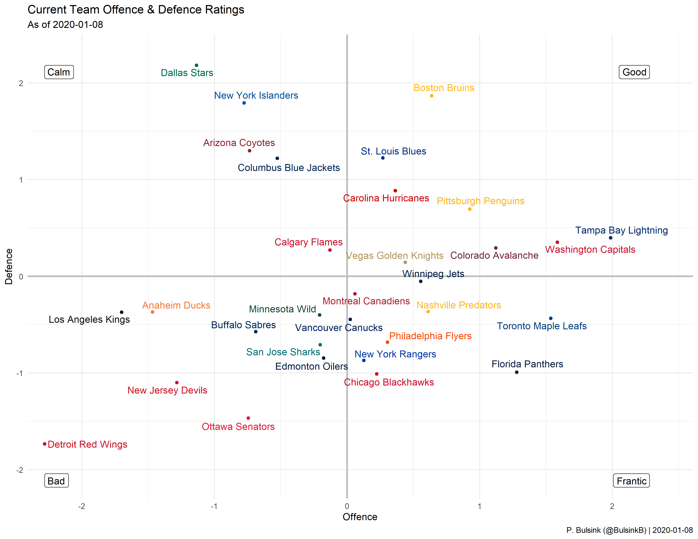
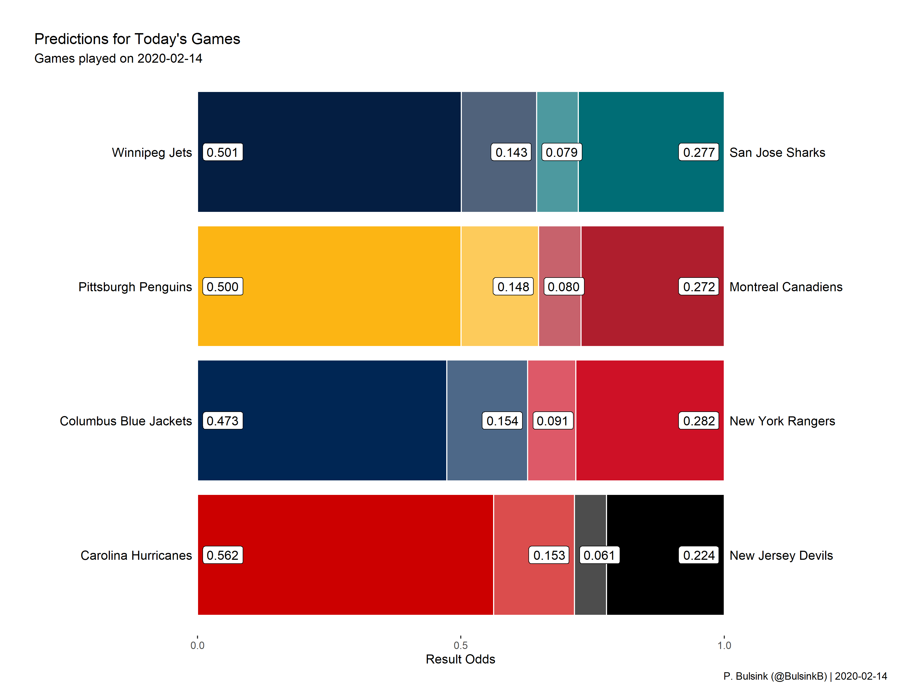
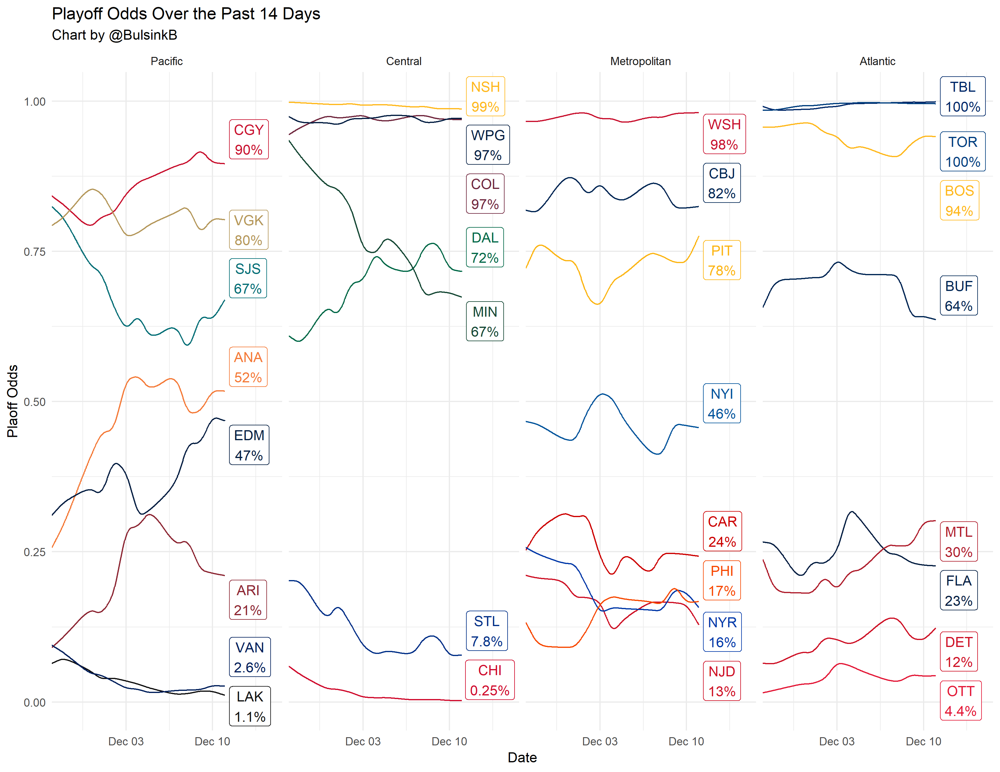
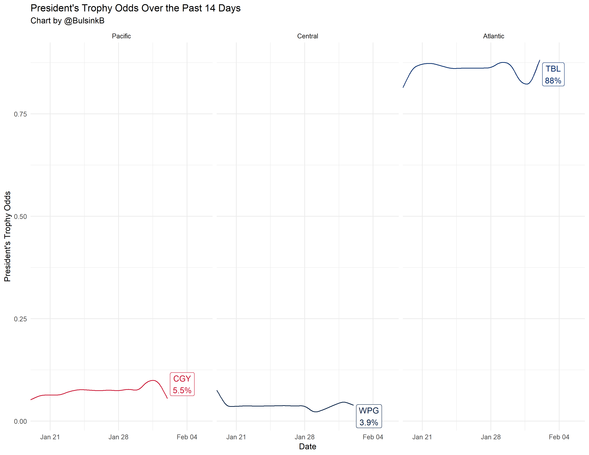

# HockeyModel

This is a model to predict NHL game winners & their likely performance for the rest of the season. 

Current predictions are below, and posted on twitter at [BulsinkBot](https://www.twitter.com/BulsinkB)

##Team Ranking

##Today's Games

##Total Point Predictions

##Playoff Odds

##President's Trophy Odds

#To Do

- Twitter user @MOCallanain highlighted that the predicted tie rate is ~<0.2, when in actuality it's higher. Likely due to teams playing for loser point, can we parameterize the model to include a tie boost? 
- Prep playoff chance impact plots for Feb-April usage.
- Change DailySummary to post odds/rankings without game odds on days with no games. 

